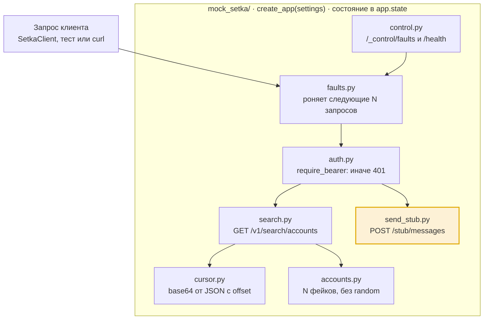

# Дизайн мока «Сетки» (#6)

Черновик для обсуждения с ментором до начала работы — см. «Вопросы к ментору» в конце.

## Контекст и цель

Мок — единственный источник правды о «Сетке», пока #20 не доберёт остаток контракта. Поэтому главное требование к дизайну: всё угаданное собрано в одном месте и помечено, чтобы расхождение с боем правилось в одном модуле, а не по всему проекту.

| Часть контракта | Статус | Источник |
| --- | --- | --- |
| `GET /v1/search/accounts`: путь, метод | снято с боя | реверс #1, вики §7.2 |
| Параметры `text`, `status_ids`, `position_ids`, `cursor` | снято с боя | реверс #1 |
| Курсор = base64 от `{"offset":N}`, шаг 40, первая страница без курсора | снято с боя | реверс #1 |
| Тело ответа поиска (имя массива, `total`, следующий курсор) | **угадано** | ждём #20 |
| Отправка сообщения и загрузка файла | **угадано целиком** | ждём #20 |
| Коды и тела ошибок | **угадано** | ждём #20 |

Потребители мока: клиент (#7, #8), worker (#12), ретраи и DLQ (#14), e2e (#15).

## Структура модулей

`mock_setka/` — отдельное FastAPI-приложение в корне репозитория (там, где его уже ждут compose и Makefile). Один модуль — одна ответственность, и только `send_stub.py` целиком построен на догадках.

Запрос сначала проходит рубильник, потом проверку токена и только потом попадает в роут. `control.py` управляет рубильником и сам ему не подчиняется. Жёлтым выделен модуль, чей контракт угадан целиком — он переписывается после #20.

| Файл | Отвечает за |
| --- | --- |
| `main.py` | `app = create_app()` — точка входа для uvicorn |
| `app.py` | `create_app(settings)`: собирает роутеры, middleware, `app.state` |
| `settings.py` | `MockSettings` из env |
| `auth.py` | зависимость `require_bearer` |
| `cursor.py` | `encode_cursor` / `decode_cursor`, `InvalidCursor` |
| `accounts.py` | генератор фейковых аккаунтов и фильтрация |
| `search.py` | роутер поиска и схема ответа |
| `send_stub.py` | заглушка отправки — **единственный модуль под замену после #20** |
| `faults.py` | `FaultInjector` и middleware |
| `control.py` | служебные ручки `/_control/*` и `/health` |
| `README.md` | список угаданного со ссылкой на #20 |

## Эндпоинты

Поиск повторяет бой точно там, где есть факты. Всё остальное — заведомая заглушка или служебная ручка под префиксом, который с боем не перепутать.

| Эндпоинт | Авторизация | Что делает | Контракт |
| --- | --- | --- | --- |
| `GET /v1/search/accounts` | Bearer | страница фейковых аккаунтов по фильтрам и курсору | запрос — бой, ответ — угадан |
| `POST /stub/messages` | Bearer | принимает multipart «адресат + текст + файл», отвечает `201` и `message_id` | целиком угадан |
| `POST /_control/faults` | нет | «рубильник»: следующие `count` запросов отвечают `status` (по умолчанию 503) | служебный |
| `DELETE /_control/faults` | нет | сбросить рубильник | служебный |
| `GET /health` | нет | для healthcheck в compose | служебный |

### Поиск

- Параметры: `text`, `status_ids`, `position_ids`, `cursor`, все необязательные. Фильтры комбинируются через «И», `text` — подстрока в имени без учёта регистра.
- Курсор: пустой или отсутствующий — offset 0; иначе base64 от `{"offset":N}`. Контрольная точка из боя: offset 40 кодируется ровно в `eyJvZmZzZXQiOjQwfQ==`. Битый курсор — `400` (угадано).
- Шаг страницы 40, как в бою; в тестах переопределяется через настройки.
- Предлагаемая (угаданная) форма ответа: `{"items": [...], "next_cursor": "..." | null}`. Аккаунт: `id` (`u_000001`, как `external_user_id` в §4 вики), `name`, `status_id`, `position_id`. Поля `total` нет — чтобы клиент не начал на нём строиться. Последняя страница — `next_cursor: null`.

### Заглушка отправки

- Путь с префиксом `/stub` намеренно: никто не примет его за боевой. В бою отправка, скорее всего, живёт под `/v2/chats/...` и требует `chat_id` (§7.4), но это гипотеза, и в мок она не зашивается.
- Тело: multipart с полями `recipient_id`, `text`, `file`. Ответ `201`: `{"message_id": "m_..."}`. Нет файла или адресата — `422` от FastAPI.
- Модуль один — `send_stub.py`: после #20 переписывается он и его тесты, остальной мок не трогается.

### Авторизация

- Одна FastAPI-зависимость `require_bearer` на всех «боевых» роутах. Нет заголовка, не `Bearer` или пустой токен — `401`. Токен `invalid` — всегда `401`. Любой другой токен принимается.
- Подпись JWT и `exp` не проверяются: стратегия по истечению токена — вопрос #21, а не этой задачи.

### Рубильник сбоев

- Класс `FaultInjector` с состоянием в памяти (сколько запросов уронить и со статусом). Применяется middleware ко всем роутам, кроме `/_control/*` и `/health`.
- Срабатывает до авторизации: так ведёт себя упавший шлюз перед сервисом.
- Работает корректно только при одном процессе uvicorn — в compose так и есть, фиксируется комментарием.

## Конфигурация, compose и данные

Аккаунты генерируются детерминированно, без `random` и без Faker: одинаковые настройки всегда дают одинаковый список. Так тесты пагинации и e2e воспроизводимы.

- `generate_accounts(n)` — чистая функция: `id` = `u_000001`…, `name` = `Тестовый пользователь 1`…, `status_id` и `position_id` циклически из коротких списков. В список позиций входит реальный UUID из реверса (`271ced3e-…`), а в список статусов — `2`.
- Настройки — `MockSettings` на pydantic-settings с префиксом `MOCK_`: `MOCK_ACCOUNTS_TOTAL` (по умолчанию 100) и `MOCK_PAGE_SIZE` (40).
- Приложение собирает фабрика `create_app(settings)`. Аккаунты и `FaultInjector` лежат в `app.state` и достаются через `Depends`. Никаких модульных глобалов: каждый тест получает свежее приложение, и рубильник из одного теста не течёт в другой. `main.py` содержит только `app = create_app()`.

Изменения инфраструктуры:

| Файл | Изменение |
| --- | --- |
| `docker-compose.yml` | убрать `profiles: ["mock"]` и комментарий про него; healthcheck на `/health`, как у api; `api` → `depends_on: setka-mock (service_healthy)` |
| `pyproject.toml` | `python-multipart` — без него FastAPI не примет `UploadFile`; `pythonpath = ["."]` в pytest, чтобы тесты видели `mock_setka` в корне |
| `.env.example` | `MOCK_ACCOUNTS_TOTAL`, `MOCK_PAGE_SIZE` с комментарием |
| `Dockerfile`, `Makefile` | без изменений: `COPY . .` уже забирает `mock_setka/`, uvicorn находит его из `/app`, а `make cov` сам добавляет `--cov=mock_setka` |

Мок не импортирует ничего из `setka_sender`, а `setka_sender` — ничего из мока. Иначе клиент сможет тихо переиспользовать угаданные схемы и перестанет ловить расхождения.

## План тестов (TDD)

Идём снизу вверх: сначала чистые функции, потом роуты через `TestClient(create_app(settings))`. Каждый пункт — красный тест, минимальный код, зелёный прогон. Тесты лежат в `tests/mock_setka/`, все unit, без сети.

1. **Курсор** (`cursor.py`): `encode_cursor(40) == "eyJvZmZzZXQiOjQwfQ=="` — боевое значение из реверса; `decode(encode(n)) == n`; пустой курсор → 0; мусор и отрицательный offset → `InvalidCursor`.
2. **Генератор** (`accounts.py`): ровно N записей, `id` уникальны, два вызова дают одинаковый список, в наборе есть боевые `status_id` и `position_id`.
3. **Авторизация** (`auth.py`): без заголовка → 401; `Basic ...` → 401; `Bearer invalid` → 401; `Bearer anything` → 200. Параметризованно по обоим боевым роутам.
4. **Пагинация** (`search.py`): обход всех страниц по `next_cursor` — сумма страниц равна N, дублей нет; курсоры разворачиваются в 40, 80, …; на последней странице `next_cursor` — `null`. Краевые случаи: N = 0, N = 40, N = 41. Битый курсор → 400.
5. **Фильтры**: `status_ids`, `position_ids` и `text` по отдельности и вместе; пагинация сходится и на отфильтрованном наборе.
6. **Заглушка отправки** (`send_stub.py`): multipart с PDF → 201 и непустой `message_id`; два вызова → разные `message_id`; без `file` или `recipient_id` → 422.
7. **Рубильник** (`faults.py`): `count=2, status=503` → два запроса получают 503, третий — 200; `/_control/*` и `/health` рубильник не тратят; `DELETE` сбрасывает; сбой срабатывает и без токена (раньше 401); `status` вне 500–599 → 422.
8. **Настройки** (`settings.py`): `MOCK_ACCOUNTS_TOTAL` и `MOCK_PAGE_SIZE` из env меняют поведение поиска.
9. **Ручная проверка compose** (фиксируется в PR): `docker compose up -d` поднимает `setka-mock` без профиля, он healthy, `curl -H "Authorization: Bearer x" localhost:8001/v1/search/accounts` отдаёт 40 записей.

Целевое покрытие `mock_setka/` — не ниже 90 %, в общий gate 85 % оно уже входит через `make cov`.

## Вопросы к ментору

Пять решений, после которых можно садиться за первый красный тест. В каждом — предложение по умолчанию.

- [ ] **Форма ответа поиска.** Берём `{items, next_cursor}` без `total`? Альтернатива — не отдавать курсор вовсе, чтобы клиент считал offset сам («пустая страница = конец»). Второй вариант делает клиент устойчивее, если в бою `next_cursor` не окажется.
- [ ] **Путь заглушки отправки.** `/stub/messages` с `recipient_id` — или сразу моделируем гипотезу «сначала чат, потом сообщение» из §7.4? Предлагаю первое: второе забетонирует догадку в два эндпоинта вместо одного.
- [ ] **Журнал отправок.** Нужна ли ручка `GET /_control/messages`, чтобы e2e (#15) проверял, что до «Сетки» дошло именно то, что записано в `sent_log`? Дёшево сделать сейчас, как и рубильник. Предлагаю да.
- [ ] **Порядок рубильника и авторизации.** Сбой срабатывает до проверки токена (как упавший шлюз) — ок? Нужен ли фильтр по пути, чтобы ронять только отправку, не трогая поиск? Для T12 предлагаю необязательный `path_prefix`.
- [ ] **Зависимости мока.** Мок живёт в том же образе и `pyproject.toml`, что и приложение, поэтому `python-multipart` попадает в общие зависимости. Для загрузки PDF в api (#9) он всё равно нужен, так что отдельной группы `[mock]` не делаю. Ок?
